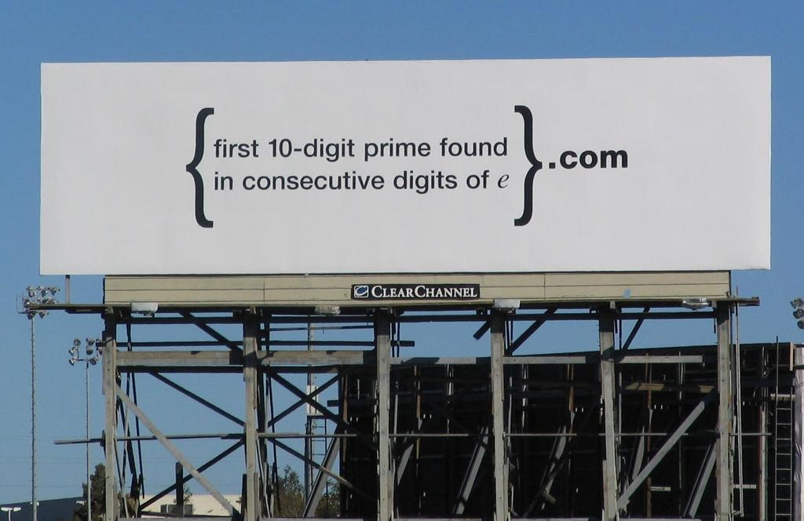

# Google Billboard Challenge

After reading "Androids" from Chet Haase, I found that 
Google was using a funny challenge to hire some people.  
I wanted to solve the puzzle (very) quickly using Rust.

In Silicon Valley, Google used a billboard to display a 
puzzle, which allows you to decrypt a message, access
to a website in order to solve a second puzzle, and finally use the response to access another website and send your application as a software engineer.

All started with this billboard...

An article about the subject: http://haacked.com/archive/2004/07/13/google-mysterious-billboard.aspx/.
